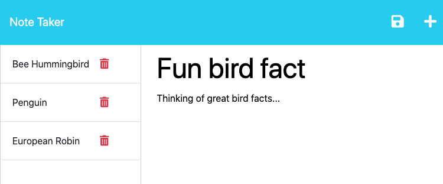
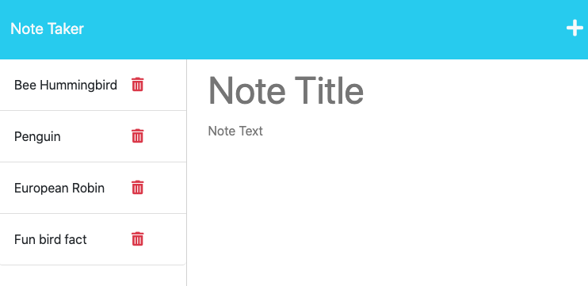
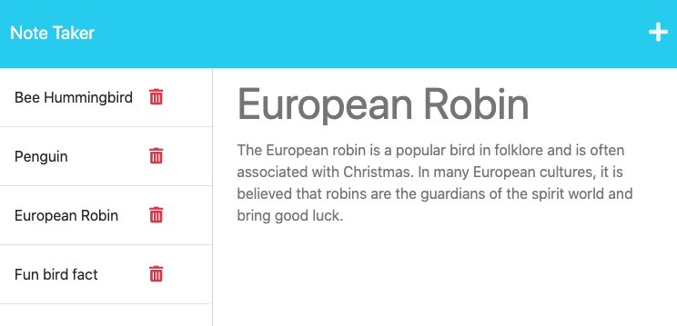

# Note Taking App (powered by Express.js)

## Description

This JavaScript based application will allow the user to write and save notes.

Express.js is used as a basis for back-end operations, which is used to save and retrieve note data from a JSON file. This is the builder's first experience in building a full-stack app, incorporating the front-end with the back-end of a web app.

[Deployment Link (via Heroku)](https://note-taking-app-23.herokuapp.com/)

## Usage

Access the web app using the deployment link above.

Click on the 'Get Started' button on the landing page to access the Notes page.

Enter your note (Note Title & body of note) in the right side of the Note Taker.

Click on the '+' icon on the top right of the page to add a fresh note.

Click on the notes on the left sidebar to view an existing note.

Click on the Trash icon to remove a note.

## Credits

Starter code (front end) and helper files (fsUtils & uuid) by University of Adelaide.

## License

